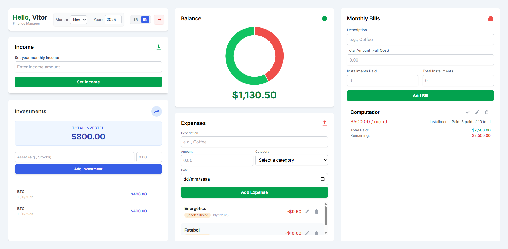
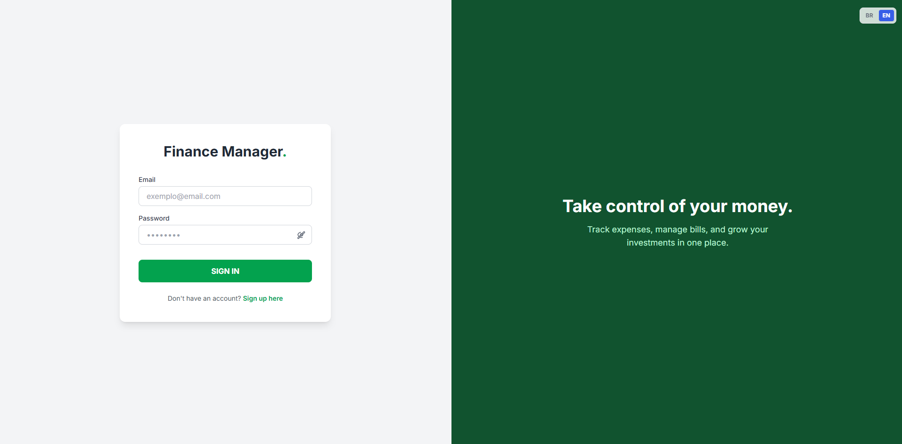
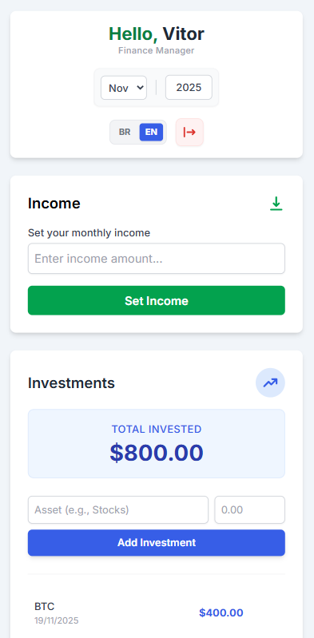

# 💰 Finance Manager - Full Stack SaaS


---

## 🇺🇸 English Version

A complete personal financial management system built with a modern Full-Stack architecture. It features multi-user support, real-time dashboard, internationalization, and persistent data storage.

---

## 🚀 Live Demo / Demonstração Online

**[Link do seu Deploy na Vercel aqui]**

> **Note:** To ensure 24/7 availability without database costs, the live demo uses **LocalStorage**. Your data is saved locally in your browser. The full MySQL integration is available for local setup.
>
> **Nota:** Para garantir disponibilidade 24/7 sem custos de banco de dados, a demo online utiliza **LocalStorage**. Seus dados ficam salvos localmente no seu navegador. A integração completa com MySQL está disponível para configuração local.

---

### 📸 Screenshots

<div align="center">
  
  <br>
  <div style="display: flex; justify-content: center; gap: 10px; margin-top: 10px;">
    
    
  </div>
</div>

### ✨ Key Features

* **🔐 Secure Authentication:** Login and Registration system using **JWT** (JSON Web Tokens) and **Bcrypt** encryption. Data is isolated per user.
* **🌍 Internationalization (i18n):** Full support for **English (USD)** and **Portuguese (BRL)**, togglable in real-time.
* **📊 Interactive Dashboard:**
    * **Charts:** Visual breakdown of expenses vs. income using Chart.js.
    * **Date Filters:** Navigate through months and years to analyze specific periods.
* **💸 Smart Financial Tools:**
    * **Recurring Bills:** Track installments (e.g., 1/12) with a smart lock that prevents double payments in the same month.
    * **Expenses:** Categorized tracking (Food, Transport, etc.) with color-coded badges.
    * **Investments:** Portfolio tracking with historical date logging.
* **📱 Responsive Design:** Fully adapted for Desktop (Fixed Dashboard) and Mobile (Scrollable View).
* **✏️ Full CRUD:** Create, Read, Update, and Delete any record securely.

### 🛠️ Tech Stack

**Frontend:**
* React.js (Vite)
* Tailwind CSS
* Context API (State Management & i18n)
* Chart.js & React-Chartjs-2
* React Router DOM

**Backend:**
* Node.js
* Express.js
* MySQL (Relational Database)
* JWT & Bcrypt.js

---

### ⚙️ How to Run

#### 1. Database Setup (MySQL)
Create a database named `finance_db` and run the following SQL script to create the schema:

```sql
CREATE DATABASE IF NOT EXISTS finance_db;
USE finance_db;

-- Users Table
CREATE TABLE users (
    id INT AUTO_INCREMENT PRIMARY KEY,
    name VARCHAR(255) NOT NULL,
    email VARCHAR(255) NOT NULL UNIQUE,
    password VARCHAR(255) NOT NULL,
    created_at TIMESTAMP DEFAULT CURRENT_TIMESTAMP
);

-- Expenses Table
CREATE TABLE expenses (
    id INT AUTO_INCREMENT PRIMARY KEY,
    user_id INT NOT NULL,
    description VARCHAR(255) NOT NULL,
    amount DECIMAL(10, 2) NOT NULL,
    date DATE NOT NULL,
    category VARCHAR(50) NOT NULL DEFAULT 'other',
    FOREIGN KEY (user_id) REFERENCES users(id) ON DELETE CASCADE
);

-- Monthly Bills Table
CREATE TABLE bills (
    id INT AUTO_INCREMENT PRIMARY KEY,
    user_id INT NOT NULL,
    description VARCHAR(255) NOT NULL,
    total_amount DECIMAL(10, 2) NOT NULL,
    total_installments INT NOT NULL,
    paid_installments INT NOT NULL,
    last_payment_date DATE DEFAULT NULL,
    FOREIGN KEY (user_id) REFERENCES users(id) ON DELETE CASCADE
);

-- Investments Table
CREATE TABLE investments (
    id INT AUTO_INCREMENT PRIMARY KEY,
    user_id INT NOT NULL,
    description VARCHAR(255) NOT NULL,
    amount DECIMAL(10, 2) NOT NULL,
    date DATE NOT NULL DEFAULT (CURRENT_DATE),
    FOREIGN KEY (user_id) REFERENCES users(id) ON DELETE CASCADE
);

-- Income Table
CREATE TABLE incomes (
    id INT AUTO_INCREMENT PRIMARY KEY,
    user_id INT NOT NULL,
    amount DECIMAL(10, 2) NOT NULL,
    month INT NOT NULL,
    year INT NOT NULL,
    FOREIGN KEY (user_id) REFERENCES users(id) ON DELETE CASCADE
);
```

#### 2\. Backend Setup

1.  Navigate to the API folder: `cd finance-manager-api`
2.  Install dependencies: `npm install`
3.  Create a `.env` file in the API root:
    ```env
    JWT_SECRET=your_secret_key_here
    PORT=3000
    ```
4.  Configure your MySQL credentials in `db.js`.
5.  Start the server: `npx nodemon server.js`

#### 3\. Frontend Setup

1.  Open a new terminal in the project root.
2.  Install dependencies: `npm install`
3.  Start the application: `npm run dev`
4.  Access `http://localhost:5173`

-----

<br>

-----

## 🇧🇷 Gerenciador de Finanças - Full Stack SaaS

Um sistema completo de gestão financeira pessoal desenvolvido com arquitetura Full-Stack moderna. Possui suporte a múltiplos usuários, dashboard em tempo real, internacionalização e persistência de dados.

### ✨ Funcionalidades Principais

  * **🔐 Autenticação Segura:** Sistema de Login e Registro com **JWT** e criptografia de senhas. Dados isolados por usuário.
  * **🌍 Internacionalização (i18n):** Suporte completo para **Inglês (USD)** e **Português (BRL)**, alterável em tempo real.
  * **📊 Dashboard Interativo:**
      * **Gráficos:** Análise visual de saldo vs. gastos usando Chart.js.
      * **Filtros Temporais:** Navegação entre meses e anos para analisar períodos específicos.
  * **💸 Ferramentas Financeiras:**
      * **Contas Fixas:** Controle de parcelas (ex: 1/12) com trava inteligente que impede pagamento duplo no mesmo mês.
      * **Gastos:** Categorização (Lanche, Uber, etc.) com etiquetas coloridas.
      * **Investimentos:** Acompanhamento de portfólio com registro de data.
  * **📱 Design Responsivo:** Interface adaptada para Desktop (Dashboard Fixo) e Mobile (Rolagem).
  * **✏️ CRUD Completo:** Criar, Ler, Atualizar e Deletar qualquer registro.

### 🛠️ Tecnologias Utilizadas

**Frontend:**

  * React.js (Vite)
  * Tailwind CSS
  * Context API (Gerenciamento de Estado & i18n)
  * Chart.js
  * React Router DOM

**Backend:**

  * Node.js
  * Express.js
  * MySQL (Banco de Dados Relacional)
  * JWT & Bcrypt.js

-----

### ⚙️ Como Rodar o Projeto

#### 1\. Configuração do Banco de Dados

Crie um banco de dados chamado `finance_db` no seu MySQL e execute o script SQL listado na seção em inglês acima para criar as tabelas.

#### 2\. Configuração do Backend (API)

1.  Entre na pasta da API: `cd finance-manager-api`
2.  Instale as dependências: `npm install`
3.  Crie um arquivo `.env` na raiz da pasta da API com:
    ```env
    JWT_SECRET=sua_chave_secreta
    PORT=3000
    ```
4.  Configure seu usuário/senha do MySQL no arquivo `db.js`.
5.  Inicie o servidor: `npx nodemon server.js`

#### 3\. Configuração do Frontend

1.  Abra um novo terminal na raiz do projeto.
2.  Instale as dependências: `npm install`
3.  Inicie a aplicação: `npm run dev`
4.  Acesse `http://localhost:5173`

-----

## 👨‍💻 Author / Autor

Developed by **Vitor Noms Kuhn**.

[]([https://www.google.com/search?q=https://www.linkedin.com/in/vitornoms-dev/](https://www.google.com/search?q=https://www.linkedin.com/in/vitornoms-dev/))
[](mailto:vitornoms@gmail.com)